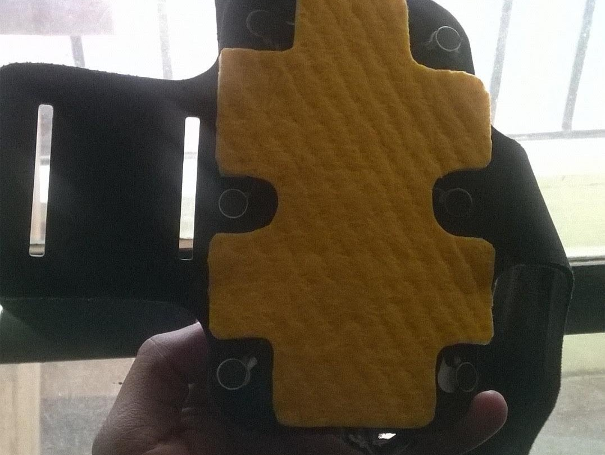
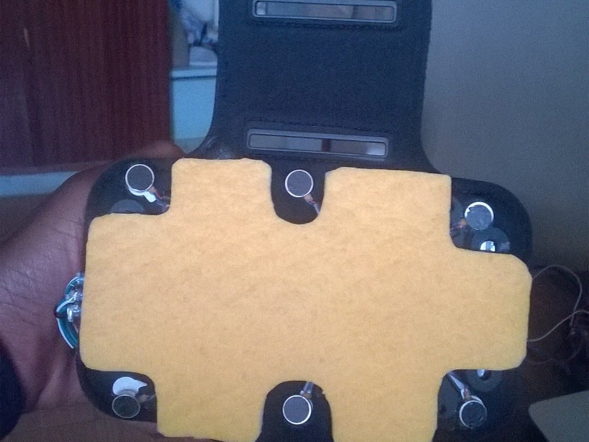
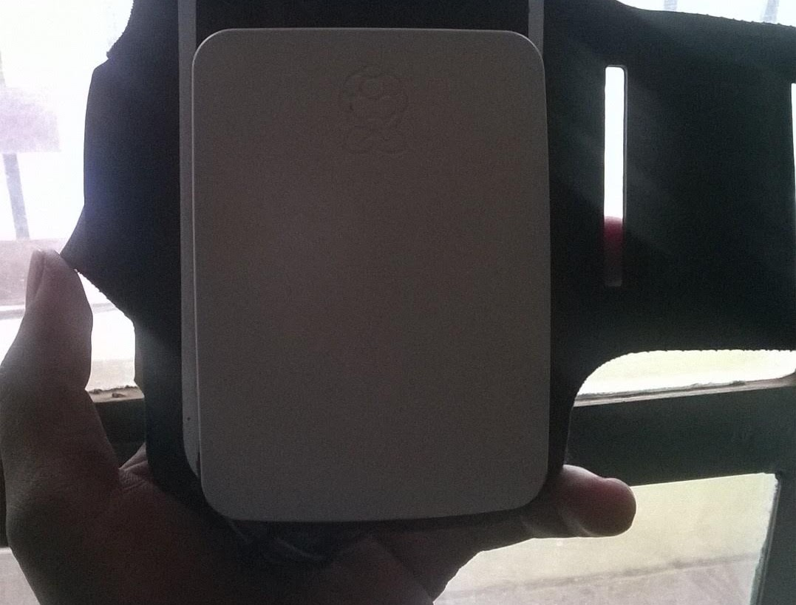

# 🦾 Odi2 Assistive Communication Device for Deafblind

A tactile-to-audio & haptic assistive communication hardware interface designed to enable seamless interaction for deafblind individuals.

## 📸 Project Gallery
| Wearable Front View | Internal Hardware & Actuators | Back View |
| :---: | :---: | :---: |
|  |  |  |

## 📖 Overview
**Odi2** is an innovative assistive technology device engineered to bridge the communication gap for individuals who are deafblind. Using a custom tactile interface, the device converts Braille and haptic inputs into synthesized speech and text for sighted/hearing individuals, and translates incoming speech/text back into physical haptic vibrations.

## 🛠️ Key Features
- **Tactile Braille Input Matrix:** Ergonomic haptic pushbuttons enabling fast Braille character entry.
- **Audio Synthesis Engine:** Real-time text-to-speech module outputting spoken words to hearing listeners.
- **Haptic Feedback Motor Array:** Vibration feedback patterns corresponding to incoming messages.
- **Portable & Low Power:** Optimized battery power management for all-day wearable or handheld use.

## 🔌 Hardware Architecture
- Microcontroller Unit (ESP32 / Microchip AVR)
- Haptic Vibration Actuators (LRA / ERM Motors)
- Audio DAC & I2S Amplifier Speaker Driver
- Tactile Microswitches
